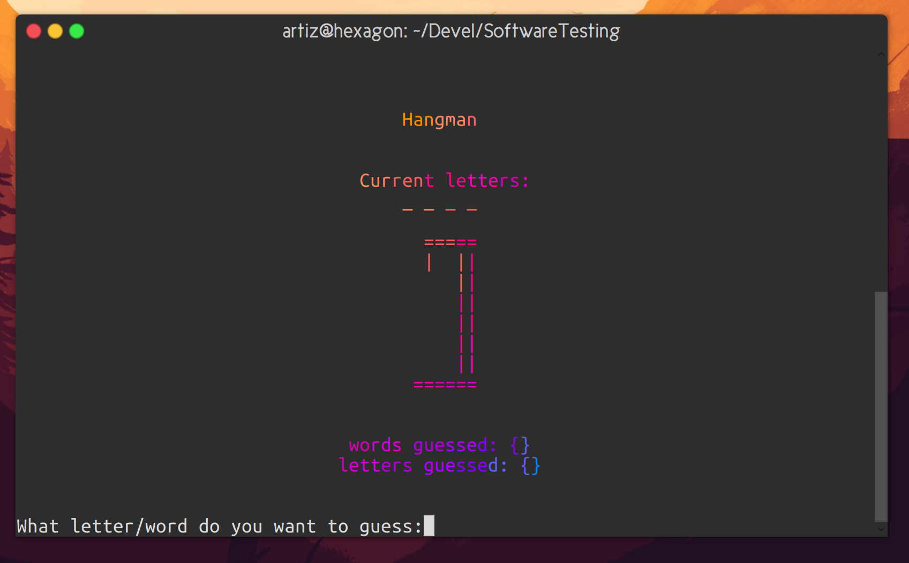

# Hanged

**By Arthur, Lars, Radu and Roy**

A binary of a hangman game with documentation for software testing




The usage of the tool can be automatically obtained by running the tool
with the `-h` or `--h` flags. With output as below

```
usage: hanged [-h] [-w filename] [-d word] [-l]

A hangman game

optional arguments:
  -h, --help            show this help message and exit
  -w filename, --word-list filename
                        a wordlist file, words newline seperated
  -d word, --debug word
                        debug option, specifies the word that needs to be
                        guessed
  -l, --lolcat          posix terminal only, uses ANSI codes to lolcat it.
```

On it's own it uses a rather small wordlist, aka 3 words, but a wordlist `words.lst`
can be easily plugged in with the `-w` option.

Also to make blackbox testing easier we've added a nice `-d` option which let's
you pick the exact word to guess, rather than create some hack around it.

And the lolcat option pukes rainbow ansi colours, which are only supported in
posix terminals, more for fun than anything else.

**NOTE**: the current version is compiled for Linux x64, if you need to run it on a different
OS please let us know.
